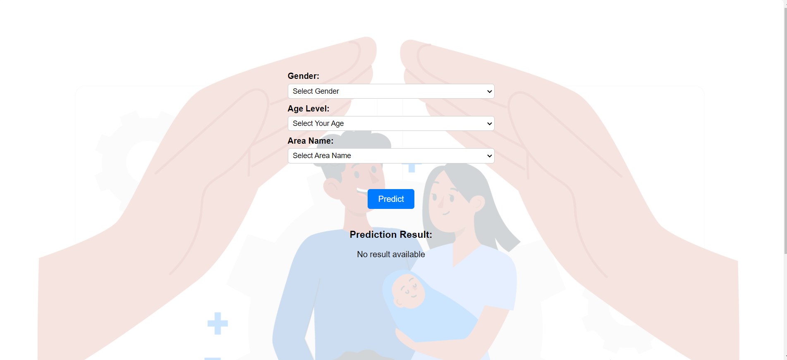
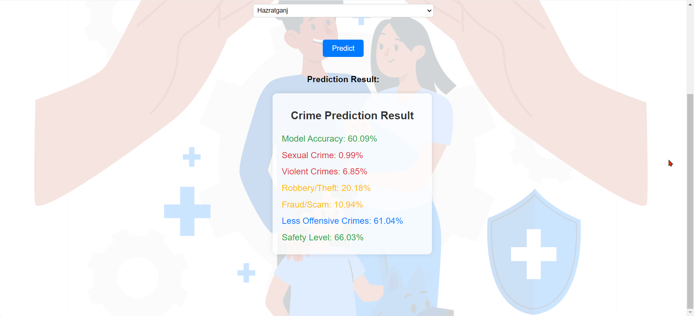
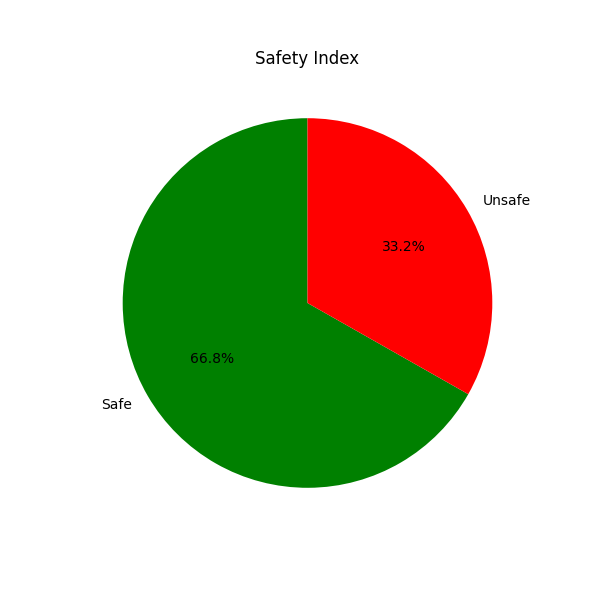
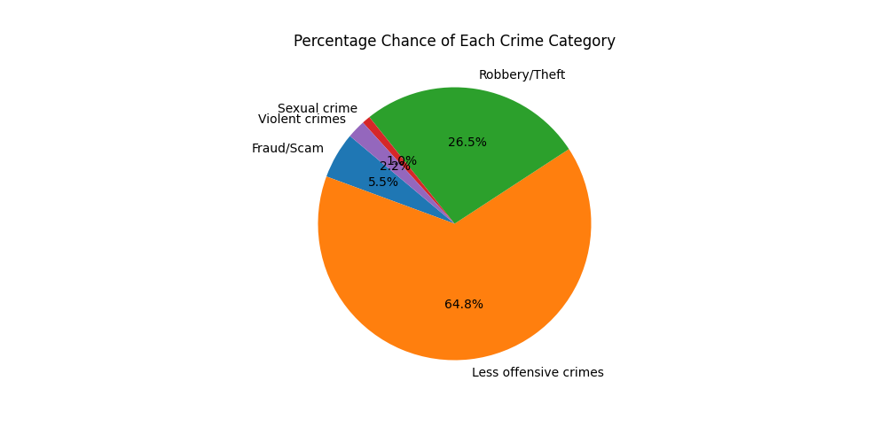

# SafeZone

This project is a machine learning-based crime prediction model that predicts various types of crimes and their likelihood of occurrence in different areas. The model is built using a database with more than 50,000 rows of data, and it utilizes a Random Forest Classifier for its predictions. The backend integration is handled using Flask, and the frontend is developed with React.

## Website Link

[SafeZone](https://avneeshrai07.github.io/SafeZone/)

## Features

- **Crime Prediction**: Predicts the likelihood of various crimes such as sexual crimes, violent crimes, robbery/theft, fraud/scam, and less offensive crimes.
- **Model Accuracy**: Displays the accuracy of the prediction model.
- **Safety Index**: Provides a safety level for the selected area based on the predictions.
- **User-Friendly Interface**: Allows users to select their gender, age level, and area name to get predictions.
- **Large Database**: Utilizes a comprehensive database with over 50,000 rows of data to ensure accurate predictions.
- **Backend Integration**: Uses Flask for handling backend operations and integrating the machine learning model.
- **Random Forest Classifier**: Employs a Random Forest Classifier for making crime predictions.

## Screenshots

## Technologies Used

- **Frontend**: React
- **Backend**: Flask
- **Machine Learning**: Random Forest Classifier
- **Database**: Extensive dataset with over 50,000 rows

## How It Works

1. **User Input**: Users input their gender, age level, and area name.
2. **Prediction Request**: The input data is sent to the backend where the machine learning model is hosted.
3. **ML Model**: The Random Forest Classifier processes the input data and makes predictions.
4. **Result Display**: The predictions are sent back to the frontend and displayed to the user.

## Contributions

Contributions are welcome! Please fork the repository and submit a pull request for any improvements or new features.

## License

This project is licensed under the MIT License. See the [LICENSE](LICENSE) file for details.

## Contact

For any inquiries or issues, please contact [ofc.avneesh@gmail.com].

